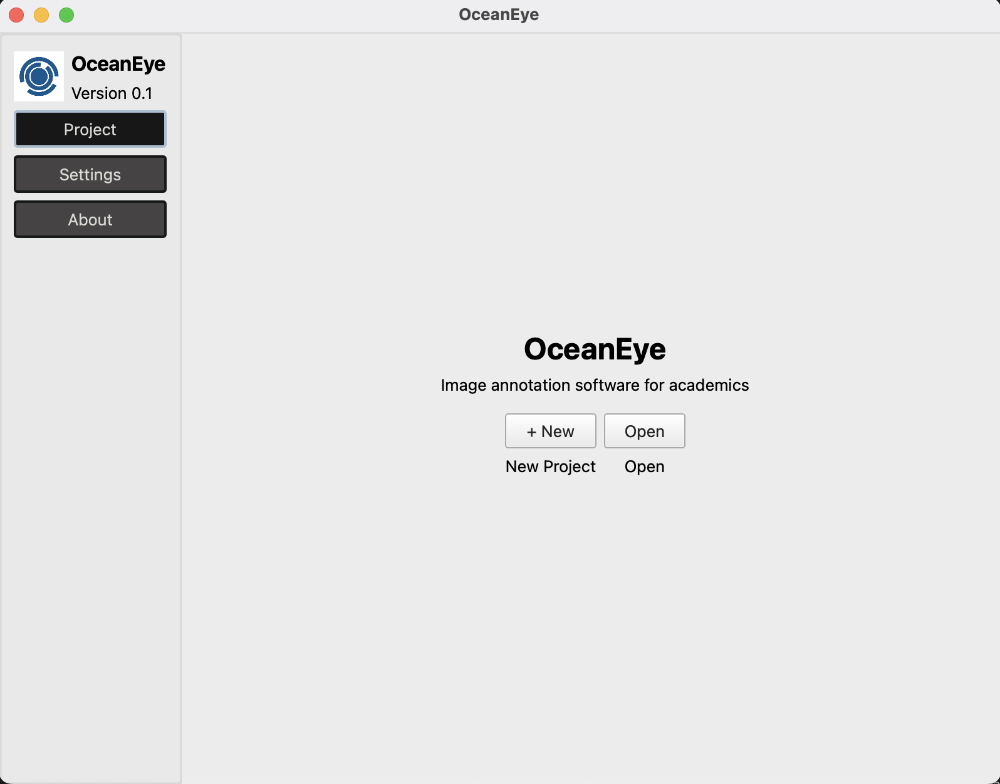
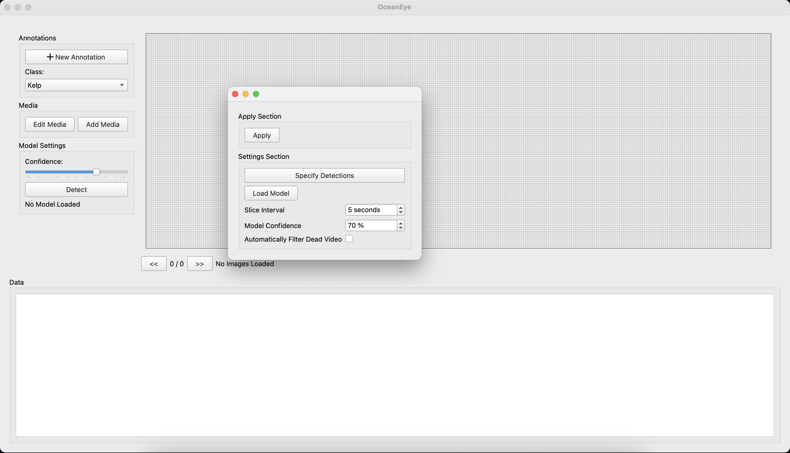

# OceanEye

### SOLIDS Lab, UVic
OceanEye is a C++ desktop application built with Qt for computer aided image annotation.

## User Guide

### Installation & Setup

1. Download the latest release from Github. 
2. Install to your location of choice.
3. Run the application.

### Application Guide

1. First-time startup will take you to the project launcher. You should see a page:

    


2. To open a project, you may either:

    - import an existing project not located by the app with "open", or;
    - start a new project.

    Ultimately, both options will result in an open project. If the project is blank, you will have this view: 
    
     

3. __Configuring a project:__

    Configuring a project involves defining the following settings. You will be prompted to do so on creation of new projects.

    - __Load model__
        - select what model will be used for detections.
    - __Specify detections__
        - Select which objects the model should write detections for.
    - __Model confidence__
        - How certain the model should be in the object in order to write the detection.
    - __Select video slice interval__
        - In the case of videos, how far apart should the frames be captured?
    - __Automatically filter dead video__
        - Select whether the video should save frames that do not include a written detection.

    Note: These settings may be changed at any time after initial configuration by navigating to the "settings" tab while in a project. 
    
    __Remember to press "Apply" when you are done!__

4. __Adding Media:__

- After configuration, you can begin to add media. Currently, we support the following formats:

    - `.MP4`
    - `.MOV`
    - `.PNG`
    - `.JPG` 

    __4.5 -  A note on detections__:
    
   - Media will be screened on upload, before being loaded into the project. Detection may be re-run on a per-frame basis with a custom confidence via the "detect" button, in the event that experimenting with confidence is desired.

   It should be noted that running "detect" on a single frame will overwrite existing detections.

5. __Exporting Data__ 

    - Data can be exported in desired format by navigating to `Export` in the top left, then selecting the desired data format and grouping.


6. __Keyboard Shortcuts__

    - Add new annotation of the same type as previous annotation: `N` 
    - When an annotation is selected, `space` may be used to cycle between classes
    - When an annotation is selected, `delete` or `backspace` may be used to remove annotations
    - When in the process of creating an annotation, `esc` may be used to cancel annotation creation
    - `R` may be used to reset the position of the image


7. __In case of application error or crash...__

    - Please create an issue under the "Issues" tab on this repository that clearly explains the problem and the actions that led to the error, providing the contents of log.txt at the time of error. Any information you can provide about your system helps!

## Developer Guide

### Requirements

Requires `Qt6` and `OpenCv`. On MacOs, both can be installed with `brew install opencv qt6`. This is a bit more challenging 

### Building & Running

#### MacOs
1. Create output directory and configure CMake
```bash
mkdir build
cmake -H. -B build
```
2. build project
```bash
cmake --build build --target OceanEye
```
3. run `OceanEye.app`
```bash
open build/OceanEye.app
```

#### Windows
Instructions coming soon!

## Directory Structure

```
OceanEye
├── models         - Pretrained ONNX YOLOv8 models
├── src            - Application code
│   ├── core       - Main application windows
│   ├── gui        - Custom widgets and layouts, etc.
│   ├── resources  - Images, styles, etc. (non-code application files)
│   └── util       - Non-Qt specific code
└── tests          - QTest files
```
